# 📊 GCash Reviews Pipeline - Understanding User Sentiment from Google Play Reviews

#### 🧠 Story Time (Context)

So during my initial project scoping process, I was initially targeting on how gambling has has evolved into a growing concern in the Philippines over the past two years. Gambling has gone so bad that influencers are throwing aways their morals just to promote gambling in which most of the people attracted to this are the lower class in which does not help (example [article](https://newsinfo.inquirer.net/2095743/32-million-adult-filipinos-are-gamblers-pagcor-records-show)). Unfortunately the popular gambling apps on Google Play Store are not accessible this is because the app can only be accessed/downloaded through the gambling website itself. As a result, I’m unable to extract user reviews or perform sentiment analysis on how people perceive these gambling apps and platforms.

I shifted my focus to GCash because of this one interaction with my mom:

> *"Anak tulugan mo nga ako mag-login sa GCash at nakailang OTP na ako di parin ako makapasok sa GCash" (Tagalog/Philippines*)
>
>"Son, can you help me login to my GCash, I’ve tried multiple OTPs and still can’t access my account."

Based on this interaction this made me think, that are other users of GCash also experiencing this? This prompted me to shift my initial target of gambling platforms to GCash and take a look if others are experiencing issues as well.


## Problem Statement

<p align="center">
  
</p>

User reviews from [GCash](https://play.google.com/store/apps/details?id=com.globe.gcash.android&hl=en) are a goldmine of opinions, people talking about bugs, frustrations, good experiences, and everything in between. The problem is, these reviews are just walls of unstructured text, making it hard to actually see patterns or get a clear sense of how users feel overall.

Scrolling through thousands of reviews manually isn’t practical, and it’s easy to miss trends—like when negative feedback suddenly spikes or when the same issue keeps showing up.

So instead of reading reviews one by one, this project builds an end-to-end data pipeline that automatically collects, processes, and analyzes GCash app reviews from the Google Play Store.

#### 🔄 Pipeline Overview

- Extract review data using [google-play-scraper](https://pypi.org/project/google-play-scraper/)
- Transform raw review text through cleaning and preprocessing
- Enrich each review using sentiment analysis to classify it as:
  - Positive
  - Neutral
  - Negative
- Assign issue categories to each review (e.g., login/OTP issues, app crashes, transaction delays, UI/UX problems) to group similar complaints together
- Load the processed data into a cloud data warehouse
- Serve the data for reporting and visualization of sentiment trends over time

The objective is to create a scalable system that converts raw user feedback into structured analytical data, allowing stakeholders to better understand how users perceive the application and quickly detect shifts in customer sentiment.


## 🏗️ Project Archietcture

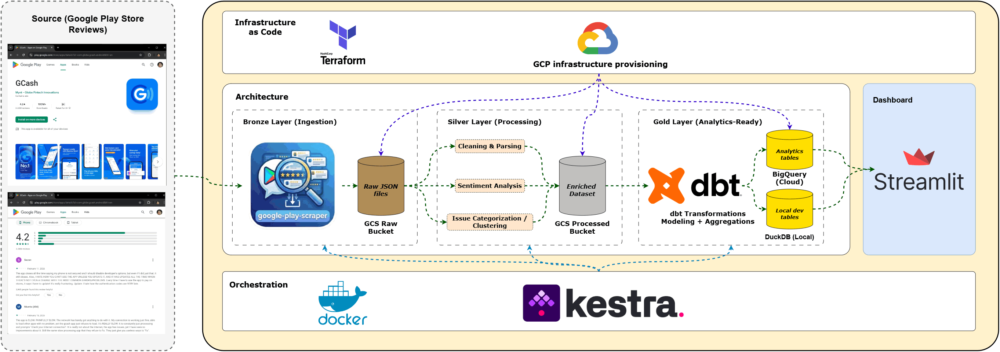

- **Infrastructure:** Terraform (GCP provisioning)

- **Ingestion (Batch Pipeline):**
  - Google Play Store scraping using [google-play-scraper](https://pypi.org/project/google-play-scraper/)
  - Raw reviews extracted as JSON

- **Data Lake (Medallion Architecture - GCS):**
  - **Bronze Layer:** Raw JSON storage -> Google Cloud Storage
  - **Silver Layer:** Cleaned and enriched datasets -> Google Cloud Storage
    - Text cleaning & preprocessing
    - Sentiment classification (Positive / Neutral / Negative)
    - Issue categorization & clustering (e.g., OTP, login issues, crashes)

- **Data Warehouse:**
  - BigQuery (primary analytical store)
  - DuckDB (local development / testing fallback)

- **Transformations (Gold Layer):**
  - dbt-based modeling inside BigQuery
  - Aggregations (sentiment trends, issue frequency, time-based analysis)
  - Creation of analytics-ready tables

- **Orchestration:**
  - Kestra (pipeline scheduling and workflow management across ingestion → processing → dbt runs)

- **Serving Layer:**
  - Streamlit dashboard for:
    - Sentiment trends over time
    - Top issue categories
    - Review clustering insights

- **Testing & Validation:**
  - Data quality checks (schema + null validation)
  - Sentiment classification validation
  - dbt transformation testing and consistency checks

-----

### Pipeline Logic and Setup

#### **🥉 Ingestion (Bronze Layer)**

The ingestion layer is implemented using a two-phase batch ingestion strategy:

| Phase            | Type                        | Purpose                   |
|------------------|-----------------------------|---------------------------|
| Backfill scraper | Full batch ingestion        | Historical reconstruction |
| Kestra pipeline  | Incremental batch ingestion | Ongoing updates           |

This ensures both:

- Complete historical coverage for analytics
- Ongoing updates for freshness

#### **1. Historical Backfill Scraper (Bootstrap Phase)**

A standalone Python script [scraper.py](ingestion/scraper.py) is used to perform a **full historical extraction of Google Play reviews** using `google-play-scraper`. This script is executed once to initialize the data lake with complete historical coverage.

The target application is identified using its Google Play Store app ID (shown below). The scraping configuration is set to `country = ph` to target reviews from the Philippines.

<p align="center">
  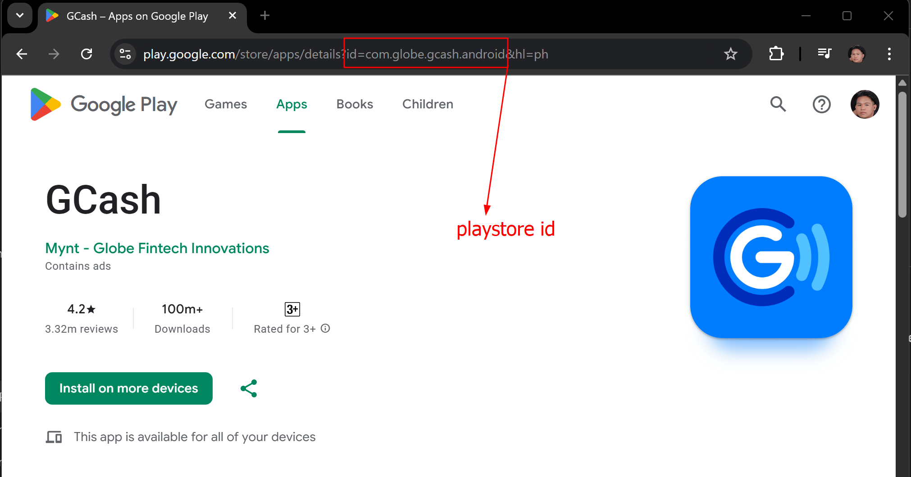
</p>

---

#### Key Behavior

- Extracts reviews in **descending chronological order (NEWEST first)**
- Uses **continuation tokens** to paginate through the full review history
- Groups extracted reviews into **monthly partitions (YYYY/MM format)**
- Uploads each completed monthly batch directly to **Google Cloud Storage (GCS) Bronze layer**
- Ensures full historical reconstruction of the dataset before incremental ingestion begins

#### Backfill Ingestion Completion

The full historical backfill process took approximately **2 hours** to complete. A total of **931,715 reviews (2012–2026)** were successfully extracted from the Google Play Store.

| Ingestion Run | Ingestion Complete |
|--------------|--------------------|
| 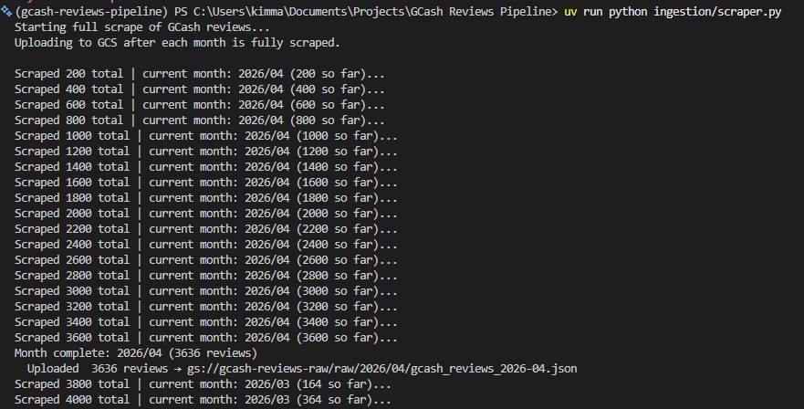 | 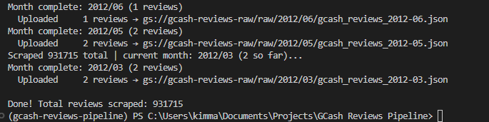 |

All records were partitioned by year and month during ingestion and uploaded to the **Google Cloud Storage Bronze layer** under the `gcash-reviews-raw` bucket.

<p align="center">
  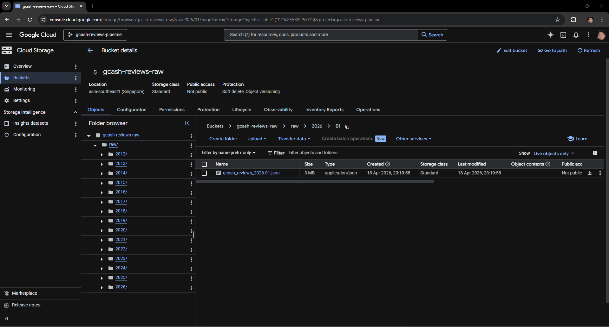
</p>

#### Returned Data Schema

Each review extract from the Google Play Store is represented as a structured JSON object with the following fields:
```json id="r8v3qp"
{
  "reviewId": "string",
  "userName": "string",
  "userImage": "string (URL)",
  "content": "string",
  "score": "integer (1–5)",
  "thumbsUpCount": "integer",
  "reviewCreatedVersion": "string",
  "at": "timestamp",
  "replyContent": "string | null",
  "repliedAt": "timestamp | null",
  "appVersion": "string"
}
```
> Note: To ensure data privacy, the `userName` and `userImage` fields will be dropped during the processing stage.

#### **2. Incremental batch ingestion (Kestra)**

The incremental ingestion layer is orchestrated using Kestra which is hosted locally in docker and is designed to continuously update the Bronze layer with newly available reviews.

> Note: To simulate a real-world incremental ingestion scenario, the historical partition for **2026-04** was intentionally removed from the bucket. This allows the Kestra pipeline to re-ingest and populate this partition as part of its scheduled execution.

This approach ensures that:
- Incremental ingestion logic is properly tested
- The pipeline can safely handle missing partitions
- Data consistency is maintained across reruns

#### Key Behavior

- Runs on a scheduled batch workflow (e.g., daily or hourly)
- References the watermark based on last review using 
  - Used [incremental_scraper.py](ingestion/incremental_scraper.py) and [watermark_seeder.py](ingestion/watermark_seeder.py) locally first before proceeding to kestra.
- Fetches only newly available reviews from the source
- Writes output directly to the **Bronze layer in Google Cloud Storage**
- Maintains the same monthly partitioning strategy (`YYYY/MM`)
- Ensures idempotent writes to prevent duplicate ingestion

#### Kestra (Broze Layer Setup)
1. Host docker locally using a docker.
2. Access `localhost:8080` as this is the port exposed in docker-compose.
3. Go to **Flows** section and create a new flow and paste the [01.incremental_ingestion.yml](kestra/flows/01_incremental_ingestion.yml) and save as new workflow

<p align="center">
  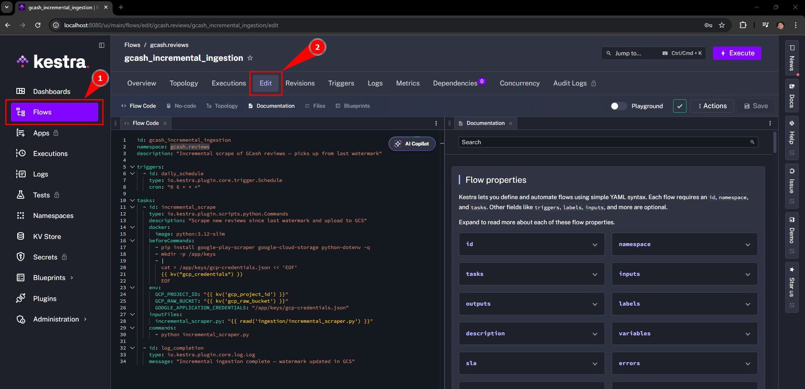
</p>

4. Go to the **KV Store** to store the needed keys and corresponding values which are the following:
   - gcp_credentials > just paste the entire content of json file here.
   - gcp_processed_bucket
   - gcp_project_id
   - gcp_raw_bucket

<p align="center">
  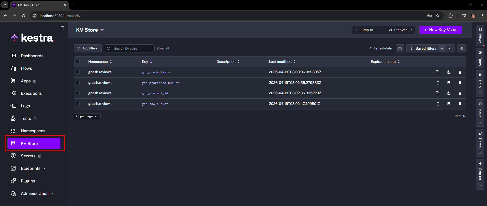
</p>

5. Lastly, go to **Namespaces** and access the namespace created in the flow (this is identified as gcash.reviews). In here go to File tab and create a folder named `ingestion` and create the file [incremental_scraper.py](ingestion/incremental_scraper.py) and paste the code here so kestra can reference it in the flow.

<p align="center">
  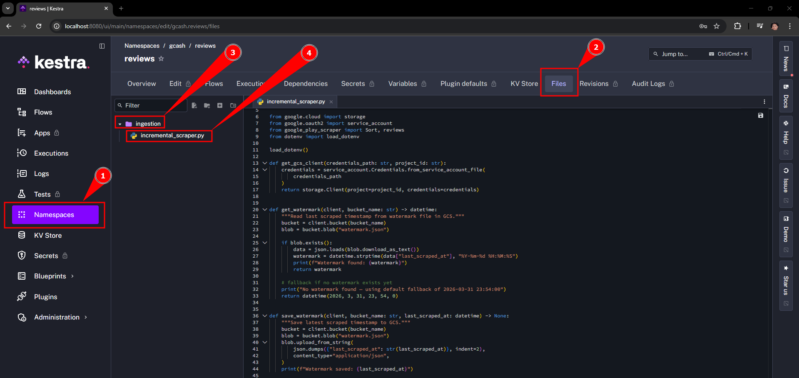
</p>

#### Incremental Batch Ingestion Completion
As mentioned earlier I will be manually deleting `April 2026` data from the bucket so we can simulate getting that data in kestra.

<p align="center">
  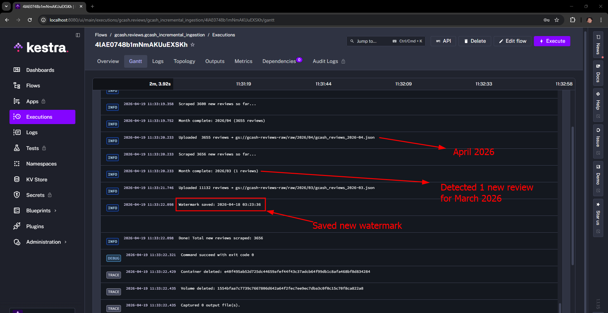
</p>


#### **🥈 Processing (Silver Layer)**

The Silver layer is responsible for transforming raw review data from the Bronze layer into a **clean, structured, and enriched dataset** that can be used for downstream analytics.

This stage is fully orchestrated using **Kestra**, where each transformation step is executed.

---

#### Objective

- Clean and standardize raw review data  
- Enrich reviews with **sentiment labels**  
- Assign **issue categories** to group similar user concerns  
- Prepare a structured dataset for loading into the data warehouse  

---

#### Processing Workflow

The Silver layer pipeline reads raw JSON files based on the year/month partition from the Bronze layer (GCS) and applies a sequence of transformations:

```text
Bronze (GCS Raw JSON)
   ↓
Data Cleaning & Preprocessing
   ↓
Sentiment Classification
   ↓
Issue Categorization / Clustering
   ↓
Silver Dataset (GCS / BigQuery Staging)
```

#### Key Transformations

- **Data Privacy & Cleaning**
  - Removes unnecessary fields (`userName`, `userImage`) to ensure data privacy compliance  
  - Retains only relevant fields for downstream processing and analysis  
  
- **Sentiment Classification (Rule-Based)**  
  - For the sake of simplicity and making this more focused on the data engineering aspect and not machine learning. I have decided to just implement a simple rule based system for classifying the sentiment based on score
     - Sentiments are categorized as follows:
       - Score 4-5 = `Positve`
       - Score 3 = `Neutral`
       - Score 1-2 = `Negative`
- **Issue Categorization (Rule-Based)**  
  - I also implemented a more simpler approach here to just list keywords that would fit a certain category in order to categorize the issue.
  - Main categories:
    - `verification` → account verification, KYC, identity issues  
    - `transaction` → payment failures, delays, transfers  
    - `login` → OTP issues, authentication problems  
    - `performance` → app crashes, lag, loading issues  
    - `ux` → user interface and usability concerns  
    - `feature` → missing features or feature requests  
    - `praise` → positive feedback or compliments  
    - `others` → uncategorized or ambiguous reviews  
  - I also did a [sanity check](notebooks/eda_categorization.ipynb) to make sure the distribution of the categorization makes sense.


#### Kestra (Silver Layer Setup)

1. Go to **Flows** section and create a new flow and paste the [02.processing.yml](kestra/flows/02_processing.yml) and save as new workflow

<p align="center">
  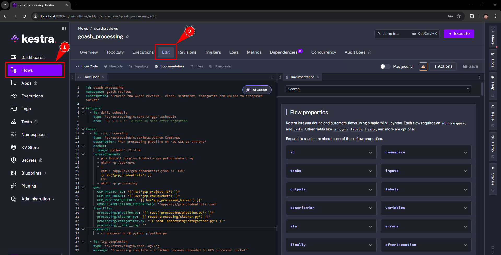
</p>

2. Lastly, go to the same **Namespaces** and access the namespace created in the flow earlier (this is identified as gcash.reviews). In here go to File tab and create a folder named `processing` and replicate the setup in the [processing](processing) folder.
> Note: You need to adjust how modules are handled in kestra because this will raise an error. To fix this simply remove the folder name "processing" for importing.

<p align="center">
  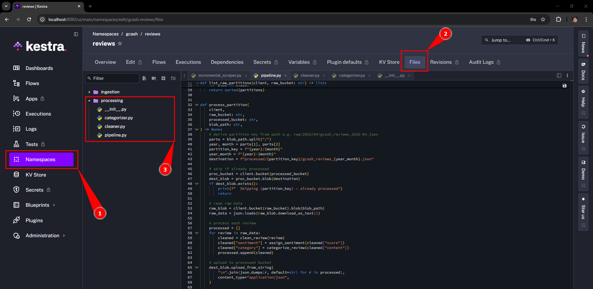
</p>

#### Processing Completion
The process is executed in Kestra and is loaded to the `gcash-reviews-processed` bucket

<p align="center">
  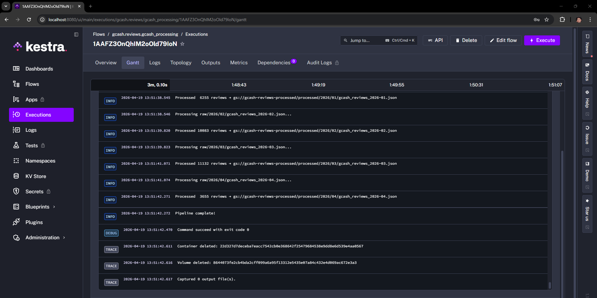
</p>

<p align="center">
  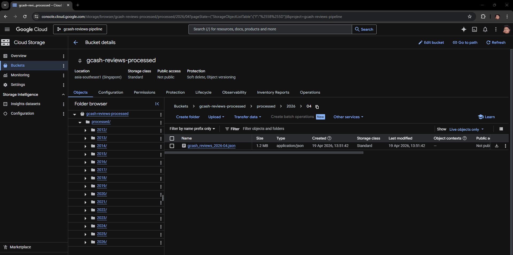
</p>

Loading the silver dataset to bigquery was also done. The approach for this is to use BigQuery external tables which points BigQuery directly at GCS JSON files, no loading needed

<p align="center">
  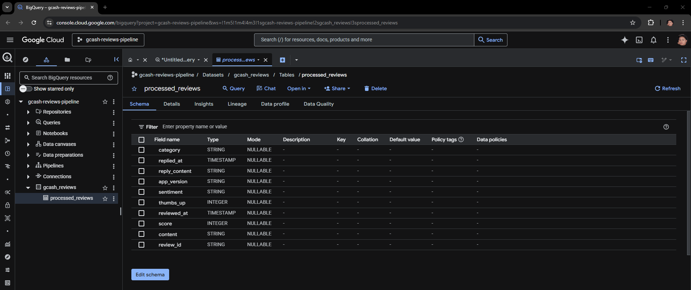
</p>


----
#### Checklist
- [x] Terraform Provision - GCP > buckets and bigquery
- [x] Ingestion:
   - [x] Histrocial Backfill - Using google-play-scraper = json
   - [x] Incremental Batch - Kestra
- [ ] Data Lake
   - [x] Raw 
   - [x] Processed
- [x] Processing > parse, clean, issue assignment, sentiment assignment and transforms
- [ ] Warehouse > local (duckdb fallback) and GCP
- [ ] dbt > Transforms
- [ ] orchestrate > Kestra
- [ ] dashboard > streamlit
- [ ] test > sentiments and transform in processing
- [ ] documentation flowcharts.