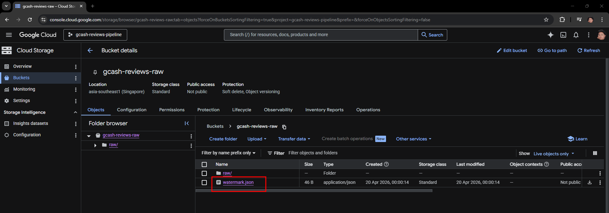
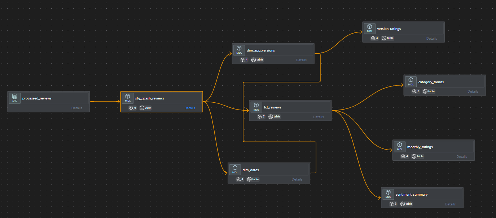
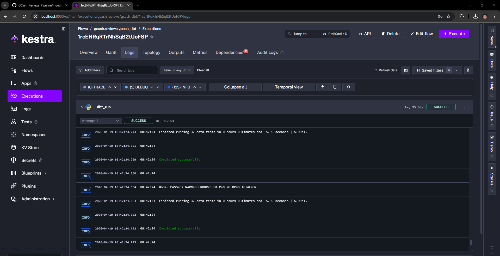
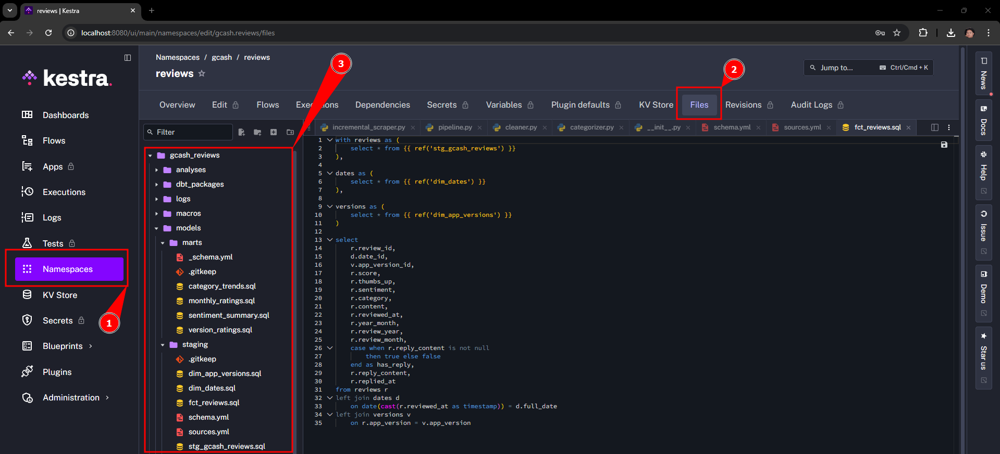
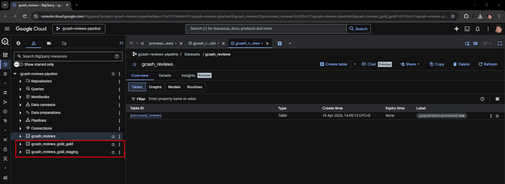
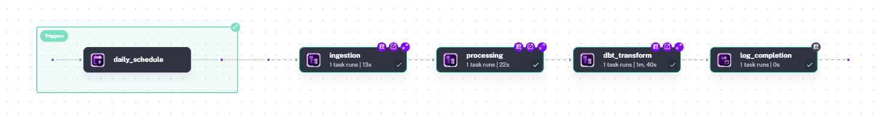
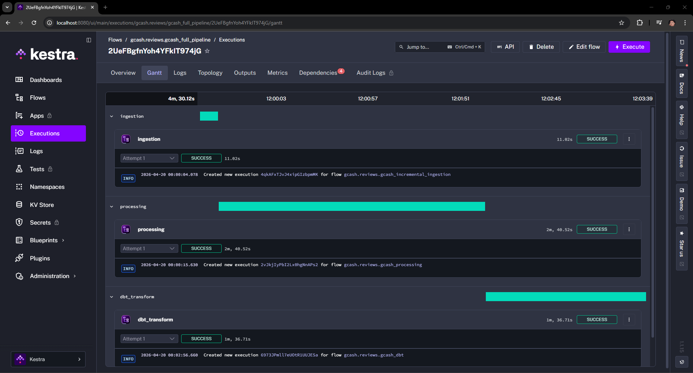
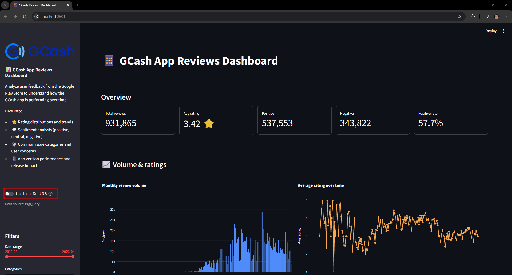

# 📊 GCash Reviews Pipeline - Understanding User Sentiment from Google Play Reviews

#### 🧠 Story Time (Context)

So during my initial project scoping process, I was initially targeting on how gambling has has evolved into a growing concern in the Philippines over the past two years. Gambling has gone so bad that influencers are throwing aways their morals just to promote gambling in which most of the people attracted to this are the lower class in which does not help (example [article](https://newsinfo.inquirer.net/2095743/32-million-adult-filipinos-are-gamblers-pagcor-records-show)). Unfortunately the popular gambling apps on Google Play Store are not accessible this is because the app can only be accessed/downloaded through the gambling website itself. As a result, I’m unable to extract user reviews or perform sentiment analysis on how people perceive these gambling apps and platforms.

I shifted my focus to GCash because of this one interaction with my mom:

> *"Anak tulugan mo nga ako mag-login sa GCash at nakailang OTP na ako di parin ako makapasok sa GCash" (Tagalog/Philippines*)
>
>"Son, can you help me login to my GCash, I’ve tried multiple OTPs and still can’t access my account."

Based on this interaction this made me think, that are other users of GCash also experiencing this? This prompted me to shift my initial target of gambling platforms to GCash and take a look if others are experiencing issues as well.


## Problem Statement

<p align="center">
  
</p>

User reviews from [GCash](https://play.google.com/store/apps/details?id=com.globe.gcash.android&hl=en) are a goldmine of opinions, people talking about bugs, frustrations, good experiences, and everything in between. The problem is, these reviews are just walls of unstructured text, making it hard to actually see patterns or get a clear sense of how users feel overall.

Scrolling through thousands of reviews manually isn’t practical, and it’s easy to miss trends—like when negative feedback suddenly spikes or when the same issue keeps showing up.

So instead of reading reviews one by one, this project builds an end-to-end data pipeline that automatically collects, processes, and analyzes GCash app reviews from the Google Play Store.

#### 🔄 Pipeline Overview

- Extract reviews data using [google-play-scraper](https://pypi.org/project/google-play-scraper/)
- Transform raw review text through cleaning and preprocessing
- Enrich each review using sentiment analysis to classify it as:
  - Positive
  - Neutral
  - Negative
- Assign issue categories to each review (e.g., login/OTP issues, app crashes, transaction delays, UI/UX problems) to group similar complaints together
- Load the processed data into a cloud data warehouse
- Serve the data for reporting and visualization of sentiment trends over time

The objective is to create a scalable system that converts raw user feedback into structured analytical data, allowing stakeholders to better understand how users perceive the application and quickly detect shifts in customer sentiment.


## 🏗️ Project Archietcture


- **Infrastructure:** Terraform (GCP provisioning)

- **Ingestion (Batch Pipeline):**
  - Google Play Store scraping using [google-play-scraper](https://pypi.org/project/google-play-scraper/)
  - Raw reviews extracted as JSON

- **Data Lake (Medallion Architecture - GCS):**
  - **Bronze Layer:** Raw JSON storage -> Google Cloud Storage
  - **Silver Layer:** Cleaned and enriched datasets -> Google Cloud Storage
    - Text cleaning & preprocessing
    - Sentiment classification (Positive / Neutral / Negative)
    - Issue categorization & clustering (e.g., OTP, login issues, crashes)

- **Data Warehouse:**
  - BigQuery (primary analytical store)
  - DuckDB (local development / testing fallback)

- **Transformations (Gold Layer):**
  - dbt-based modeling inside BigQuery
  - Aggregations (sentiment trends, issue frequency, time-based analysis)
  - Creation of analytics-ready tables

- **Orchestration:**
  - Kestra (pipeline scheduling and workflow management across ingestion → processing → dbt runs)

- **Serving Layer:**
  - Streamlit dashboard for:
    - Sentiment trends over time
    - Top issue categories
    - Review clustering insights

- **Testing & Validation:**
  - Data quality checks (schema + null validation)
  - Sentiment classification validation
  - dbt transformation testing and consistency checks

-----

### Pipeline Logic and Setup

#### **🥉 Ingestion (Bronze Layer)**

The ingestion layer is implemented using a two-phase batch ingestion strategy:

| Phase            | Type                        | Purpose                   |
|------------------|-----------------------------|---------------------------|
| Backfill scraper | Full batch ingestion        | Historical reconstruction |
| Kestra pipeline  | Incremental batch ingestion | Ongoing updates           |

This ensures both:

- Complete historical coverage for analytics
- Ongoing updates for freshness

#### **1. Historical Backfill Scraper (Bootstrap Phase)**

A standalone Python script [scraper.py](ingestion/scraper.py) is used to perform a **full historical extraction of Google Play reviews** using `google-play-scraper`. This script is executed once to initialize the data lake with complete historical coverage.

The target application is identified using its Google Play Store app ID (shown below). The scraping configuration is set to `country = ph` to target reviews from the Philippines.

<p align="center">
  
</p>


#### Key Behavior

- Extracts reviews in **descending chronological order (NEWEST first)**
- Uses **continuation tokens** to paginate through the full review history
- Groups extracted reviews into **monthly partitions (YYYY/MM format)**
- Uploads each completed monthly batch directly to **Google Cloud Storage (GCS) Bronze layer**
- Ensures full historical reconstruction of the dataset before incremental ingestion begins

#### Backfill Ingestion Completion

The full historical backfill process took approximately **2 hours** to complete. A total of **931,715 reviews (2012–2026)** were successfully extracted from the Google Play Store.

| Ingestion Run | Ingestion Complete |
|--------------|--------------------|
|  |  |

All records were partitioned by year and month during ingestion and uploaded to the **Google Cloud Storage Bronze layer** under the `gcash-reviews-raw` bucket.

<p align="center">
  
</p>

#### Returned Data Schema

Each review extract from the Google Play Store is represented as a structured JSON object with the following fields:
```json id="r8v3qp"
{
  "reviewId": "string",
  "userName": "string",
  "userImage": "string (URL)",
  "content": "string",
  "score": "integer (1–5)",
  "thumbsUpCount": "integer",
  "reviewCreatedVersion": "string",
  "at": "timestamp",
  "replyContent": "string | null",
  "repliedAt": "timestamp | null",
  "appVersion": "string"
}
```
> Note: To ensure data privacy, the `userName` and `userImage` fields will be dropped during the processing stage.

#### **2. Incremental batch ingestion (Kestra)**

The incremental ingestion layer is orchestrated using Kestra which is hosted locally in docker and is designed to continuously update the Bronze layer with newly available reviews.

> Note: To simulate a real-world incremental ingestion scenario, the historical partition for **2026-04** was intentionally removed from the bucket. This allows the Kestra pipeline to re-ingest and populate this partition as part of its scheduled execution.

This approach ensures that:
- Incremental ingestion logic is properly tested
- The pipeline can safely handle missing partitions
- Data consistency is maintained across reruns

#### Key Behavior

- Runs on a scheduled batch workflow (e.g., daily or hourly)
- References the watermark based on last review using 
  - Used [incremental_scraper.py](ingestion/incremental_scraper.py) and [watermark_seeder.py](ingestion/watermark_seeder.py) locally first before proceeding to kestra.
  - The watermark_seeder will create a `watermark.json` file inside the bucket and this will be referenced in the future runs.

<p align="center">
  
</p>

```json
{
  "last_scraped_at": "2026-04-18 15:36:04"
}
```

- Fetches only newly available reviews from the source
- Writes output directly to the **Bronze layer in Google Cloud Storage**
- Maintains the same monthly partitioning strategy (`YYYY/MM`)
- Ensures idempotent writes to prevent duplicate ingestion

#### Kestra (Broze Layer Setup)
1. Host docker locally using a docker.
2. Access `localhost:8080` as this is the port exposed in docker-compose.
3. Go to **Flows** section and create a new flow and paste the [01.incremental_ingestion.yml](kestra/flows/01_incremental_ingestion.yml) and save as new workflow

<p align="center">
  
</p>

4. Go to the **KV Store** to store the needed keys and corresponding values which are the following:
   - gcp_credentials > just paste the entire content of json file here.
   - gcp_processed_bucket > gcash-reviews-processed
   - gcp_project_id > gcash-reviews-pipeline
   - gcp_raw_bucket > gcash-reviews-raw

<p align="center">
  
</p>

5. Lastly, go to **Namespaces** and access the namespace created in the flow (this is identified as gcash.reviews). In here go to File tab and create a folder named `ingestion` and create the file [incremental_scraper.py](ingestion/incremental_scraper.py) and paste the code here so kestra can reference it in the flow.

<p align="center">
  
</p>

#### Incremental Batch Ingestion Completion
As mentioned earlier I will be manually deleting `April 2026` data from the bucket so we can simulate getting that data in kestra.

<p align="center">
  
</p>

--- 

#### **🥈 Processing (Silver Layer)**

The Silver layer is responsible for transforming raw review data from the Bronze layer into a **clean, structured, and enriched dataset** that can be used for downstream analytics.

This stage is fully orchestrated using **Kestra**, where each transformation step is executed.

#### Objective

- Clean and standardize raw review data  
- Enrich reviews with **sentiment labels**  
- Assign **issue categories** to group similar user concerns  
- Prepare a structured dataset for loading into the data warehouse  

#### Processing Workflow

The Silver layer pipeline reads raw JSON files based on the year/month partition from the Bronze layer (GCS) and applies a sequence of transformations:

```text
Bronze (GCS Raw JSON)
   ↓
Data Cleaning & Preprocessing
   ↓
Sentiment Classification
   ↓
Issue Categorization / Clustering
   ↓
Silver Dataset (GCS / BigQuery Staging)
```

#### Key Transformations

- **Data Privacy & Cleaning**
  - Removes unnecessary fields (`userName`, `userImage`) to ensure data privacy compliance  
  - Retains only relevant fields for downstream processing and analysis  
  
- **Sentiment Classification (Rule-Based)**  
  - For the sake of simplicity and making this more focused on the data engineering aspect and not machine learning. I have decided to just implement a simple rule-based system for classifying the sentiment based on score
     - Sentiments are categorized as follows:
       - Score 4-5 = `Positve`
       - Score 3 = `Neutral`
       - Score 1-2 = `Negative`
- **Issue Categorization (Rule-Based)**  
  - I also implemented a more simpler approach here to just list keywords that would fit a certain category in order to categorize the issue.
  - Main categories:
    - `verification` → account verification, KYC, identity issues  
    - `transaction` → payment failures, delays, transfers  
    - `login` → OTP issues, authentication problems  
    - `performance` → app crashes, lag, loading issues  
    - `ux` → user interface and usability concerns  
    - `feature` → missing features or feature requests  
    - `praise` → positive feedback or compliments  
    - `others` → uncategorized or ambiguous reviews  
  - I also did a [sanity check](notebooks/eda_categorization.ipynb) to make sure the distribution of the categorization makes sense.


#### Kestra (Silver Layer Setup)

1. Go to **Flows** section and create a new flow and paste the [02.processing.yml](kestra/flows/02_processing.yml) and save as new workflow

<p align="center">
  
</p>

2. Lastly, go to the same **Namespaces** and access the namespace created in the flow earlier (this is identified as gcash.reviews). In here go to File tab and create a folder named `processing` and replicate the setup in the [processing](processing) folder.
> Note: You need to adjust how modules are handled in kestra because this will raise an error. To fix this simply remove the folder name "processing" for importing.

<p align="center">
  
</p>

#### Processing Completion
The process is executed in Kestra and is loaded to the `gcash-reviews-processed` bucket

<p align="center">
  
</p>

<p align="center">
  
</p>

Loading the silver dataset to bigquery was also done. The approach for this is to use BigQuery external tables which points BigQuery directly at GCS JSON files, no loading needed

<p align="center">
  
</p>


---

#### **🥇 Transformations (Gold Layer)**

The Gold layer is responsible for transforming the enriched Silver dataset into **analytics-ready tables** optimized for reporting and visualization.

This stage uses **dbt (data build tool)** to apply dimensional modeling and build aggregate mart tables on top of the BigQuery external table.

#### Objective

- Apply dimensional modeling (fact + dimension tables)
- Build aggregated mart tables for dashboard consumption
- Enforce data quality via dbt tests

#### dbt Project Structure

```text
gcash_reviews/
├── dbt_project.yml
├── packages.yml
└── models/
    ├── staging/
    │   ├── sources.yml
    │   ├── schema.yml
    │   ├── stg_gcash_reviews.sql    ← cleaned view on top of external table
    │   ├── dim_dates.sql             ← date dimension
    │   ├── dim_app_versions.sql      ← app version dimension
    │   └── fct_reviews.sql           ← core fact table
    └── marts/
        ├── _schema.yml
        ├── monthly_ratings.sql       ← monthly aggregate ratings
        ├── sentiment_summary.sql     ← monthly sentiment distribution
        ├── category_trends.sql       ← monthly category breakdown
        └── version_ratings.sql       ← ratings by app version
```

#### Transformation Workflow

```text
Silver (BigQuery External Table — processed_reviews)
   ↓
stg_gcash_reviews (view — clean & cast columns)
   ↓
dim_dates          dim_app_versions
        ↘         ↙
         fct_reviews (fact table — one row per review)
              ↓
    ┌─────────────────────────┐
    │  monthly_ratings        │
    │  sentiment_summary      │
    │  category_trends        │
    │  version_ratings        │
    └─────────────────────────┘
```

#### Dimensional Model

The Gold layer follows a **star schema** pattern:
>> Side Note: This schema is sort of a hybrid dimensional warehouse: a core star schema surrounded by a set of downstream data marts for performance and reporting.

| Table | Type | Description |
|---|---|---|
| `stg_gcash_reviews` | View | Cleaned staging layer on top of external table |
| `dim_dates` | Dimension | Calendar table with year, month, quarter, day of week |
| `dim_app_versions` | Dimension | App version metadata with ratings and sentiment breakdown |
| `fct_reviews` | Fact | One row per review with FK references to dimensions |
| `monthly_ratings` | Mart | Monthly aggregate ratings, star breakdown, reply rate |
| `sentiment_summary` | Mart | Monthly sentiment distribution with percentages |
| `category_trends` | Mart | Monthly category breakdown with sentiment split |
| `version_ratings` | Mart | Ratings and sentiment breakdown per app version |

<p align="center">
  
</p>

#### Data Quality Tests

dbt tests are defined across all models to ensure data integrity:

| Test | Models | Description |
|---|---|---|
| `unique` | `review_id`, `date_id`, `app_version_id` | No duplicate keys |
| `not_null` | All key columns | No missing critical fields |
| `accepted_values` | `score`, `sentiment`, `category` | Values within expected range |

All **37 tests pass** successfully.

<p align="center">
  
</p>

#### Kestra (Gold Layer Setup)

1. Go to **Flows** section and create a new flow and paste the [03_dbt.yml](kestra/flows/03_dbt.yml) and save as new workflow
2. Go to the same **Namespaces** and upload all dbt model files under `gcash_reviews/models/` replicating the local folder structure

<p align="center">
  
</p>

3. Execute the flow — dbt will install packages, run all models, and execute all tests

#### Gold Tables in BigQuery

After the dbt run completes, the following datasets are available in BigQuery:

| Dataset | Contents |
|---|---|
| `gcash_reviews_gold_staging` | `stg_gcash_reviews`, `dim_dates`, `dim_app_versions`, `fct_reviews` |
| `gcash_reviews_gold_gold` | `monthly_ratings`, `sentiment_summary`, `category_trends`, `version_ratings` |

<p align="center">
  
</p>

---

#### **🔁 Orchestration**

The full pipeline is orchestrated using **Kestra** running locally via Docker. All four flows are chained together in a master pipeline that runs on a daily schedule.
> Note: When running the full pipeline we must first disable/comment out the triggers or flow schedules in each step: ingestion, processing and dbt_transform. This so to avoid double-runs.

| Flow | ID | Schedule | Description |
|---|---|---|---|
| Incremental ingestion | `gcash_incremental_ingestion` | Disabled (runs via master) | Scrape new reviews |
| Processing | `gcash_processing` | Disabled (runs via master) | Clean and enrich reviews |
| dbt transformations | `gcash_dbt` | Disabled (runs via master) | Build Gold tables |
| **Full pipeline** | `gcash_full_pipeline` | `0 5 * * *` (5AM daily) | Chains all three flows |

<p align="center">
  
</p>

<p align="center">
  
</p>


## 📱 Dashboard 


**Dasboard Link**: https://gcash-app-reviews-dashboard.streamlit.app/

The dashboard is built using **Streamlit** and provides an interactive interface to explore GCash app reviews across multiple dimensions. It connects to **BigQuery** as the primary data source with a **DuckDB local fallback** for offline use accesing the [gcash_reviews.parquet](notebooks/gcash_reviews.parquet) generated when running the eda notebook.

### Data Source Toggle

The dashboard supports two data sources switchable via a toggle in the sidebar:

| Mode | Source | When to use |
|---|---|---|
| Default | BigQuery (Cloud) | Production — queries Gold layer tables directly |
| Fallback | DuckDB (Local) | Offline development — reads from local parquet file |

<p align="center">
  
</p>

### Sidebar Filters

The following filters are available on the sidebar and apply globally across all charts:

| Filter | Description |
|---|---|
| **Date range** | Slide to select a specific time window (year-month) |
| **Categories** | Filter by one or more issue categories |
| **Sentiment** | Filter by positive, neutral, or negative sentiment |
| **App versions** | Filter by specific app version(s) — defaults to all |

---

### Dashboard Sections

#### 📊 KPI Cards

Five high-level metrics displayed at the top of the dashboard reflecting the current filter selection:

| Metric | Description |
|---|---|
| Total reviews | Total number of reviews in the selected period |
| Avg rating | Average star rating across all filtered reviews |
| Positive | Total count of positive reviews |
| Negative | Total count of negative reviews |
| Positive rate | Percentage of reviews classified as positive |

#### 📈 Volume & Ratings

Covers the overall review activity and rating trends over time:

- **Monthly review volume** — Bar chart showing how many reviews were submitted each month
- **Average rating over time** — Line chart tracking the average star rating per month with y-axis fixed between 1 and 5


#### 💬 Sentiment Analysis

- **Sentiment distribution over time** — Stacked area chart showing the monthly breakdown of positive, neutral, and negative reviews

Color encoding:
- 🟢 Positive
- ⚪ Neutral
- 🔴 Negative

#### 🗂️ Issue Categories

Four charts providing a deep dive into the issue categorization:

- **Reviews by category** — Horizontal bar chart ranked by volume
- **Category share** — Donut chart showing the proportional split across categories
- **Category trends over time** — Line chart tracking each category's monthly volume
- **Sentiment breakdown by category** — Stacked bar chart showing the sentiment split within each category

Categories covered:

| Category | Description |
|---|---|
| `praise` | Positive feedback and compliments |
| `transaction` | Payment failures, transfers, cash-in/out issues |
| `verification` | KYC, identity verification, account verification |
| `performance` | App crashes, lag, loading issues |
| `login` | OTP issues, authentication, account access |
| `feature` | Feature requests and suggestions |
| `ux` | User interface and usability concerns |
| `other` | Uncategorized or ambiguous reviews |

#### 📦 App Version Analysis

Three views for understanding performance across app versions:

- **Top 20 versions by avg rating** — Horizontal bar chart with a red-yellow-green color scale
- **Top 20 versions by review volume** — Horizontal bar chart showing which versions received the most reviews
- **Sentiment breakdown — top 15 versions by volume** — Stacked bar chart showing positive, negative, and neutral counts per version
- **Version details table** — Sortable dataframe showing `app_version`, `total_reviews`, `avg_rating`, `positive_pct`, `negative_pct`, `first_review_date`, `last_review_date`

#### ☁️ Review Wordcloud

A wordcloud generated from the full text of all reviews using the most frequently occurring words. This gives a quick visual summary of the language and topics that appear most often across the entire dataset.

- Maximum **200 words** displayed
- Color scheme: **Blues** colormap
- Rendered using the `wordcloud` Python library


## 🛠️ Conclusion and Points for Improvement
### Conclusion
This project successfully demonstrates an end-to-end data engineering pipeline built on modern open-source and cloud-native tools. Starting from raw Google Play Store reviews, the pipeline ingests, processes, transforms, and serves **931,715 (volume when I initially finished the first run) GCash app reviews spanning 2012 to 2026** through a fully orchestrated medallion architecture.

The pipeline achieves the following:

- **Reproducible infrastructure** provisioned via Terraform on Google Cloud Platform
- **Two-phase ingestion strategy** combining a one-time historical backfill with daily incremental updates orchestrated by Kestra
- **Automated processing** that cleans, enriches, and categorizes reviews using rule-based sentiment and issue classification — designed to handle multilingual content (English and Filipino/Tagalog)
- **Dimensional modeling** in BigQuery via dbt, producing analytics-ready Gold tables with full test coverage
- **Interactive dashboard** built in Streamlit that visualizes review trends, sentiment distribution, issue categories, and app version performance

### Points for Improvement:
- **Streaming ingestion** > Since this is live data and there are live reviews coming in the app store. I feel like a streaming type of ingestion could work better than daily batch ingestion. The reason I say this is because when I was running the full pipeline multiple times I noticed a discrepancy between the raw and processed buckets basically not being the same due to new reviews arriving between runs. A streaming pipeline would eliminate this lag and keep all layers in sync in near real-time.
- **Improved issue categorization** — The current keyword-based classifier leaves approximately **29% of reviews uncategorized** (`other`). A more robust approach would be to use a multilingual zero-shot classification model (e.g. HuggingFace `mDeBERTa`) that can handle both English and Tagalog reviews without requiring labeled training data.
- **Multilingual sentiment analysis** — The current rule-based sentiment classification using star ratings is reliable but loses nuance. A review can have a 3-star rating but contain strongly negative language. A multilingual sentiment model would capture this more accurately.
- **Idempotent ingestion** — Running the pipeline multiple times in quick succession 
  can cause duplicate records in the raw bucket due to a race condition between the 
  watermark save and the next pipeline execution. This is handled at the dbt staging 
  layer via `QUALIFY ROW_NUMBER()` deduplication but ideally should be prevented 
  upstream by making the ingestion layer fully idempotent.

## Project Setup

### Prerequisites

| Tool | Version | Purpose |
|---|---|---|
| Python | >= 3.12 | Runtime |
| uv | latest | Python package manager |
| Terraform | >= 1.5 | Infrastructure provisioning |
| Docker Desktop | latest | Kestra orchestration |
| Git | latest | Version control |

Google Cloud Platform (GCP) Requirements:
- A **Google Cloud Platform** account with billing enabled
- A **GCP project** created and noted down
- A **GCP service account** with the following roles:
  - `Storage Object Admin`
  - `BigQuery Data Editor`
  - `BigQuery Job User`
- A service account **JSON key file** downloaded locally

### Full Setup

<details>
  <summary>Setup Instructions - Click to expand</summary>

### 1. Clone the repository

```bash
git clone https://github.com/Kimchi21/GCash_Reviews_Pipeline.git
cd gcash-reviews-pipeline
```

---

### 2. Set up Python environment

Install dependencies using `uv`:

```bash
uv sync
```

---

### 3. Configure credentials and environment variables

Create a `keys/` folder at the project root and place your GCP service account JSON key file inside:

```
gcash-reviews-pipeline/
└── keys/
    └── service-account-key.json
```

Create a `.env` file at the project root:

```bash
GCP_PROJECT_ID=your-gcp-project-id
GCP_RAW_BUCKET=gcash-reviews-raw
GCP_PROCESSED_BUCKET=gcash-reviews-processed
GOOGLE_APPLICATION_CREDENTIALS=keys/your-service-account-key.json
```

---

### 4. Provision GCP infrastructure via Terraform

Navigate to the `terraform/` folder and update `terraform.tfvars` with your project details:

```hcl
project_id            = "your-gcp-project-id"
raw_bucket_name       = "gcash-reviews-raw"
processed_bucket_name = "gcash-reviews-processed"
bq_dataset_id         = "gcash_reviews"
```

Then initialise and apply:

```bash
cd terraform
terraform init
terraform apply
```

Type `yes` when prompted. This will create:
- GCS Raw Bucket (`gcash-reviews-raw`)
- GCS Processed Bucket (`gcash-reviews-processed`)
- BigQuery dataset (`gcash_reviews`)
- BigQuery external table (`processed_reviews`)

---

### 5. Run historical backfill

Navigate back to the project root and run the historical scraper to populate the Bronze layer:

```bash
cd ..
uv run python ingestion/scraper.py
```

> ⚠️ This will take approximately **2 hours** (or depends on internet speed) to complete as it scrapes the full review history (~931k reviews). The script uploads monthly partitions to GCS in real time so you can monitor progress in the GCS console.

---

### 6. Seed the watermark

After the backfill completes, seed the watermark file so the incremental scraper knows where to pick up from:

```bash
uv run python ingestion/watermark_seeder.py
```

---

### 7. Run the processing pipeline

Process all raw partitions and upload enriched data to the Silver layer:

```bash
uv run python processing/pipeline.py
```

---

### 8. Run dbt transformations

Navigate to the `gcash_reviews/` dbt project folder and run the models:

```bash
cd gcash_reviews
uv run dbt deps
uv run dbt run
uv run dbt test
```

All **37 tests** should pass. Navigate back to the project root after completion:

```bash
cd ..
```

---

### 9. Set up Kestra

Start Kestra using Docker Compose:

```bash
docker compose up -d
```

Access the Kestra UI at `http://localhost:8080` and log in with:

```
Username: admin@kestra.io
Password: Admin1234!
```

#### 9a. Configure KV Store

Go to **Namespaces** → `gcash.reviews` → **KV Store** and add the following keys:

| Key | Value |
|---|---|
| `gcp_project_id` | your GCP project ID |
| `gcp_raw_bucket` | `gcash-reviews-raw` |
| `gcp_processed_bucket` | `gcash-reviews-processed` |
| `gcp_credentials` | paste entire contents of your service account JSON key file |

#### 9b. Upload namespace files

Go to **Namespaces** → `gcash.reviews` → **Files** and upload the following files maintaining the folder structure:

```
ingestion/
└── incremental_scraper.py

processing/
├── pipeline.py
├── cleaner.py
└── categorizer.py

gcash_reviews/
├── dbt_project.yml
├── packages.yml
└── models/
    ├── staging/
    │   ├── sources.yml
    │   ├── schema.yml
    │   ├── stg_gcash_reviews.sql
    │   ├── dim_dates.sql
    │   ├── dim_app_versions.sql
    │   └── fct_reviews.sql
    └── marts/
        ├── _schema.yml
        ├── monthly_ratings.sql
        ├── sentiment_summary.sql
        ├── category_trends.sql
        └── version_ratings.sql
```

#### 9c. Create Kestra flows

Go to **Flows** → **Create** and paste each of the following flow files:

| Flow file | Description |
|---|---|
| `kestra/flows/01_incremental_ingestion.yml` | Incremental scraper |
| `kestra/flows/02_processing.yml` | Processing pipeline |
| `kestra/flows/03_dbt.yml` | dbt transformations |
| `kestra/flows/04_full_pipeline.yml` | Master orchestration flow |

---

### 10. Run the full pipeline

Trigger the master pipeline manually in Kestra UI:

1. Go to **Flows** → `gcash_full_pipeline`
2. Click **Execute**
3. Monitor the execution logs for each subflow

The pipeline will run automatically every day at **5AM** going forward.

---

### 11. Launch the Streamlit dashboard

Generate the local parquet file for the DuckDB fallback:

```bash
uv run jupyter notebook notebooks/
```

Run Cell 1 and Cell 2 in `eda.ipynb` to generate `notebooks/gcash_reviews.parquet`.

Before running the dashboard create first the streamlit secrets in the root directory.
> Note: This is similar to how environment variables are setup but is using a toml format (values must be a key value for example `GCP_PROJECT_ID = "gcash-reviews-pipeline"`)

```
gcash-reviews-pipeline/
│
├── .streamlit/                                   
    └── secrets.toml
```

Then launch the dashboard:

```bash
uv run streamlit run dashboard/app.py
```

Open `http://localhost:8501` in your browser.

---
> When running the pipeline while the dashboard is open. Clear the cache then reload the dashboard in order to reflect changes.


</details>


### Project tree

```
gcash-reviews-pipeline/
│
├── keys/                                        # gitignored
│   └── service-account-key.json
│
├── terraform/
│   ├── main.tf
│   ├── variables.tf
│   ├── outputs.tf
│   └── terraform.tfvars
│
├── ingestion/
│   ├── scraper.py                               # historical backfill
│   ├── incremental_scraper.py                   # incremental ingestion
│   └── watermark_seeder.py                      # watermark initializer
│
├── processing/
│   ├── cleaner.py                               # parsing & cleaning
│   ├── categorizer.py                           # sentiment classification and issue categorization
│   ├── pipeline.py                              # orchestrates all steps
|   └── __init__.py                              # package initialize
│
├── gcash_reviews/                               # dbt project
│   ├── dbt_project.yml
│   ├── packages.yml
│   └── models/
│       ├── staging/
│       │   ├── stg_gcash_reviews.sql
│       │   ├── dim_dates.sql
│       │   ├── dim_app_versions.sql
│       │   ├── fct_reviews.sql
│       │   ├── sources.yml
│       │   └── schema.yml
│       └── marts/
│           ├── monthly_ratings.sql
│           ├── sentiment_summary.sql
│           ├── category_trends.sql
│           ├── version_ratings.sql
│           └── _schema.yml
│
├── kestra/
│   └── flows/
│       ├── 01_incremental_ingestion.yml
│       ├── 02_processing.yml
│       ├── 03_dbt.yml
│       └── 04_full_pipeline.yml
│
├── notebooks/
│   ├── eda_categorization.ipynb
|   ├── gcash_reviews.parquet                      # For local fallback
│
├── dashboard/
│   └── app.py                                     # Streamlit dashboard
|
├── .streamlit/
│   └── secrets.toml                               # Streamlit secrets (gitignored)
|
├── .env                                           # gitignored
├── .gitignore
├── pyproject.toml
├── uv.lock
└── README.md
```

---

#### Checklist
- [x] Terraform Provision - GCP > buckets and bigquery
- [x] Ingestion:
   - [x] Histrocial Backfill - Using google-play-scraper = json
   - [x] Incremental Batch - Kestra
- [x] Data Lake
   - [x] Raw 
   - [x] Processed
- [x] Processing > parse, clean, issue assignment, sentiment assignment and transforms
- [x] Warehouse > local (duckdb fallback) and GCP
- [x] dbt > Transforms
- [x] orchestrate > Kestra
- [x] dashboard > streamlit
- [x] test > sentiments and transform in processing
- [x] documentation flowcharts.
- [ ] learning in public

---

## Acknowledgements

- This project was developed in compliance with the requirements for the final capstone project.

- Special thanks to the instructors and contributors of the [Data Engineering Zoomcamp](https://github.com/DataTalksClub/data-engineering-zoomcamp) for providing excellent learning materials and guidance throughout the program.